# Release Bug Review — agentic RCA automation

This skill automates the post-release bug review: classifies each bug with the **PM RCA Type** field, links each bug to its feature in your feature project, and splits actions into high-confidence (auto-apply) and judgment-call (review) tiers.

**The agentic automation insight:** Most of this work is mechanical (pulling bugs, classifying against a rubric, building docs, splitting by confidence), but the PM's mapping judgment must stay human. The pipeline is "agentic" because the orchestrator (`run_review.py`) chains deterministic tools together and **stops at decision points** where human judgment matters:

```mermaid
flowchart TD
    START(["run_review.py --version 1.2.6.0 --prev-versions 1.2.5.0,1.2.4.0"])
    START --> PRE{"preflight<br/>token · claude CLI · site reachable?"}
    PRE -->|"missing"| EXIT["exit with setup instructions<br/>nothing written"]

    PRE -->|"ok"| PULL["1 · pull_bugs.py + pull_features.py<br/><i>current + prior releases</i>"]
    PULL --> D1[("bugs_&lt;v&gt;.json<br/>features_&lt;v&gt;.json")]

    D1 --> CLS["2 · classify_headless.py<br/><i>shells out to</i> claude -p"]
    RUBRIC[/"classification_rubric.md<br/>SKILL.md steps 2-3<br/>feature PRDs"/] --> CLS
    CLS --> D2[("analysis_&lt;v&gt;.json<br/><i>RCA type · confidence · match basis</i>")]
    D2 --> VAL{"validate_schema<br/>every bug well-formed?"}
    VAL -->|"no"| EXIT

    VAL -->|"yes"| BUILD["3 · build_deliverables.py"]
    BUILD --> D3[("Bug_Review_&lt;v&gt;_Analysis.md<br/>Bug_Review_&lt;v&gt;_Rollup.xlsx<br/>plan_&lt;v&gt;.json")]

    D3 --> SPLIT{"4 · split_plan.py<br/>which actions are <i>facts</i>?"}
    SPLIT -->|"confidence == high<br/>AND match basis == linked_issues"| AUTO[("plan.auto.json")]
    SPLIT -->|"medium/low confidence<br/>PRD-content match<br/>PM Analysis text"| REVIEW[("plan.review.json")]

    AUTO --> DRY["5 · write_back.py --dry-run<br/><i>prints every change, writes nothing</i>"]
    DRY -->|"--dry-run-only"| STOPOK["stop — read-only smoke test"]
    DRY --> CANARY{"6 · canary: --limit 5<br/>any failures?"}
    CANARY -->|"yes"| ABORT["abort before full apply<br/>only 5 issues touched"]
    CANARY -->|"no"| FULL["7 · full apply<br/><i>idempotent: skips set RCA + existing links</i>"]
    FULL --> JIRA[("Jira")]
    FULL --> VERIFY{"8 · verify — re-fetch every bug<br/>does Jira match the plan?"}
    JIRA -.->|"re-read"| VERIFY
    VERIFY -->|"mismatch"| FLAG["flagged in NEEDS_REVIEW"]

    VERIFY --> NR["9 · needs_review.py"]
    REVIEW --> NR
    FLAG --> NR
    NR --> NRDOC[("NEEDS_REVIEW_&lt;v&gt;.md")]

    NRDOC --> HUMAN{{"HUMAN GATE — the PM decides<br/>Is each medium-confidence RCA call right?<br/>Are the PRD-content feature links right?"}}
    HUMAN -->|"edit plan.review.json,<br/>then run the same ladder by hand"| MANUAL["write_back.py --allow-review-tier<br/><i>flag required; run_review.py never passes it</i>"]
    MANUAL --> JIRA

    LEDGER[("runs.jsonl + logs/<br/><i>local audit trail</i>")]
    NR -.->|"one line per run"| LEDGER

    classDef tool fill:#dbeafe,stroke:#1e40af,color:#0b1a3a
    classDef llm fill:#ede9fe,stroke:#5b21b6,color:#1e1035
    classDef data fill:#f1f5f9,stroke:#475569,color:#0f172a
    classDef gate fill:#fef3c7,stroke:#b45309,color:#3b2503
    classDef human fill:#dcfce7,stroke:#15803d,color:#052e16
    classDef stop fill:#fee2e2,stroke:#b91c1c,color:#450a0a

    class PULL,BUILD,DRY,FULL,NR,MANUAL tool
    class CLS,RUBRIC llm
    class D1,D2,D3,AUTO,REVIEW,NRDOC,JIRA,LEDGER data
    class PRE,VAL,SPLIT,CANARY,VERIFY gate
    class HUMAN human
    class EXIT,ABORT,STOPOK,FLAG stop
```



Reading the colors: **blue** = deterministic tools, **purple** = the one LLM step, **grey** = files on disk, **amber** = gates the code enforces, **green** = the human decision, **red** = a stop.

The load-bearing idea is the amber `split_plan.py` gate. An LLM classified every bug, but only two kinds of action are allowed through without a person: an RCA value the rubric itself calls `high` confidence, and a feature link that was **already an explicit link in Jira** — a fact read out of the bug's own data, never the model's inference from reading a PRD. Everything else routes to the human gate, and `write_back.py` refuses a `tier: "review"` plan unless a person types `--allow-review-tier`. The orchestrator's own source never contains that flag, so "the PM confirms before write-back" is a property of the code, not a convention someone has to remember.

**Why this is "agentic"**: The orchestrator chains independent tools intelligently, collecting facts along the way (bugs, features, rubric match results), and uses those facts to make deterministic decisions (confidence-based tier split, feature matching based on existing links). It never skips a decision—it just pushes judgment calls to the human at the right moment. Each tool is a "capability" the agent uses; the orchestrator is the "reasoning loop" that decides which tools to run and when to pause.

Built for **Jira Server / Data Center**. Self-hosted sites are often only reachable from inside the corporate network, so the data pulls and write-backs run from a machine that can reach yours, and the LLM-based classification happens headless via `claude -p`. Nothing about the site, project, or field names is hard-coded — it all comes from `scripts/.env`.

## One-time setup

### 1. Generate a Personal Access Token in Jira

1. Log in to your Jira site.
2. Avatar (top-right) → **Profile** → **Personal Access Tokens** → **Create token**.
3. Name it anything (`bug review`). Pick the longest expiry your policy allows.
4. Copy the token — you won't see it again.

### 2. Configure the site and token

In the `scripts/` folder, create a `.env` file (copy `.env.example` and fill it in):

```
JIRA_BASE_URL=https://jira.example.com
JIRA_PAT=paste-your-token-here
JIRA_FEATURE_PROJECT=PROJ
```

Everything else is optional — see `.env.example` for the full list. Any of these can be exported in your shell instead; the scripts pick up either.

| Variable | Required | Default |
|---|---|---|
| `JIRA_BASE_URL` | yes | — |
| `JIRA_PAT` | yes | — |
| `JIRA_FEATURE_PROJECT` | yes (for feature pulls) | — |
| `JIRA_FEATURE_ISSUETYPES` | no | `New Feature Request` |
| `JIRA_COMPONENTS` | no | unset = all components on the release |
| `JIRA_LINK_TYPE` | no | `Requirement Link` |
| `JIRA_RCA_FIELD_NAME` | no | `PM RCA Type` |
| `JIRA_ANALYSIS_FIELD_NAME` | no | `PM Analysis` |
| `JIRA_RCA_FIELD_ID` | no | `customfield_19330` |

### 3. Install the skill

Drop the `bug-analysis-review/` folder into your skills directory. If you rename the folder, update `name:` in `SKILL.md` to match.

## Running a review for a release

### The one-command way (the normal flow)

Everything runs from a single command on a machine that can reach your Jira site:

```
cd bug-analysis-review/scripts
python3 run_review.py --version 1.2.6.0 --prev-versions 1.2.5.0,1.2.4.0
```

This is the **agentic orchestration**. The pipeline chains:

1. **Pull** bugs + features (current + prior releases) from Jira
2. **Classify** (headless `claude -p`) — reads the rubric, reads the bugs and PRD feature pool, assigns PM RCA Type + confidence level to each bug (no hand-typed dicts anymore)
3. **Build** deliverables — doc + xlsx + full action plan from the analysis JSON
4. **Split** into auto and review tiers based on confidence and feature-match type:
   - **Auto tier**: high-confidence RCA calls + feature links that were already in JIRA (deterministic facts)
   - **Review tier**: medium/low-confidence calls, PRD-content feature matches, anything needing your judgment
5. **Dry-run** the auto tier (show what would happen, no actual changes)
6. **Apply** the auto tier: canary (5 bugs) → full → verify
7. **Write** `NEEDS_REVIEW_<version>.md` — shows what was auto-applied, what's waiting for you, and next steps

**Human judgment preserved at every decision point:**
- `NEEDS_REVIEW_<version>.md` lists all review-tier bugs; edit `plan_<version>.review.json` directly if you disagree
- Run the same apply ladder yourself when ready:

```
python3 write_back.py --plan plan_1.2.6.0.review.json --allow-review-tier --dry-run
python3 write_back.py --plan plan_1.2.6.0.review.json --allow-review-tier --limit 5
python3 write_back.py --plan plan_1.2.6.0.review.json --allow-review-tier
```

**Useful flags:**
- `--dry-run-only` — run through the whole pipeline read-only, never apply anything (good for smoke tests)
- `--reuse-pulls` — skip re-pulling if bugs/features JSON already exist
- `--bug-limit N` — cap classification to N bugs for a fast test run
- `--components` — passed through to pull_bugs.py

**Audit trail:** Every run appends one line to `scripts/runs.jsonl` — the durable local record of what was proposed, auto-applied, and left pending. Per-run logs in `scripts/logs/`. Both stay on your machine; neither is committed.

### Workflow after the orchestrator finishes

After `run_review.py` completes, you'll have:
- `analysis_<version>.json` — all bugs classified with confidence levels
- `plan_<version>.auto.json` — already applied (high-confidence RCA only)
- `plan_<version>.review.json` — waiting for you (medium/low confidence, PRD matches)
- `NEEDS_REVIEW_<version>.md` — summary of what got auto-applied and what needs your review

**To apply the review-tier plan:**

1. Read `NEEDS_REVIEW_<version>.md` — it lists everything that's waiting for you and why
2. (Optional) Edit `plan_<version>.review.json` directly if you disagree with a proposed RCA or want to change a feature link
3. Run the apply ladder with `--allow-review-tier`:

```
python3 write_back.py --plan plan_1.2.6.0.review.json --allow-review-tier --dry-run
python3 write_back.py --plan plan_1.2.6.0.review.json --allow-review-tier --limit 5
python3 write_back.py --plan plan_1.2.6.0.review.json --allow-review-tier
```

The `--allow-review-tier` flag is required; without it, `write_back.py` refuses to apply any review-tier plan (this is a code-level safety gate to enforce the PM review step).

### Emergency: manual pulls only (if the full pipeline can't run)

If you need to pull bugs and features without running the full pipeline:

```
cd bug-analysis-review/scripts
python3 pull_bugs.py --version 1.2.2.0
python3 pull_features.py --version 1.2.2.0
python3 pull_features.py --version 1.2.1.0    # also pull prior release
```

This produces `bugs_*.json` and `features_*.json` files that can be checked in or shared. Then the full pipeline can run from those cached files with `--reuse-pulls`.

## Files in this skill

```
bug-analysis-review/
├── SKILL.md                                # workflow, RCA rubric definitions, feature-matching rules
├── README.md                               # this file
├── .claude/
│   ├── settings.json                       # scoped Read/Write allowlist (main session)
│   └── headless-settings.json              # scoped allowlist for headless classify subprocess
├── reference/
│   └── classification_rubric.md            # the 5 PM RCA Type values + confidence definitions
└── scripts/
    ├── .env.example                        # every supported setting, no secrets
    ├── .gitignore                          # keeps generated output + .env out of git
    │
    ├── THE ORCHESTRATOR:
    ├── run_review.py                       # ONE COMMAND: chains all 9 steps in the agentic pipeline
    │
    ├── PIPELINE STEPS:
    ├── pull_bugs.py                        # step 1: release bugs → JSON
    ├── pull_features.py                    # step 1: candidate features → JSON (current + prior)
    ├── classify_headless.py                # step 2: headless `claude -p` → analysis_*.json
    ├── build_deliverables.py               # step 3: analysis JSON → doc + xlsx + plan
    ├── split_plan.py                       # step 4: plan → auto-tier / review-tier split
    ├── needs_review.py                     # step 9: write NEEDS_REVIEW_<version>.md
    ├── write_back.py                       # step 5/6/7: dry-run → canary → full apply → verify
    ├── validate_schema.py                  # schema checks for analysis/plan JSON
    ├── lib_run.py                          # run logger + runs.jsonl ledger helpers
    │
    ├── HELPERS (rarely called directly):
    ├── make_report_docx.py                 # markdown report → styled Word doc (python-docx)
    ├── add_label.py                        # bulk-label issues matching a JQL
    └── create_subtasks.py                  # create sub-tasks under a parent issue from a JSON spec
```

## Generated files (not committed)

**This repo tracks source only.** Everything a pipeline run produces — pulled Jira data, analysis, plans, deliverables, logs, the run ledger — is ignored and must never be committed. Two layers enforce it: the repo-root `.gitignore` ignores whole classes of file by extension (`*.json`, `*.jsonl`, `*.xlsx`, `*.docx`, `*.csv`, `*.log`, `.env*`), so an artifact with an unforeseen name is ignored by default; `scripts/.gitignore` adds by-name patterns on top. Ignored artifacts:

**Data pulls:**
- `.env` — your Jira site URL + PAT (**secret — never commit**)
- `bugs_*.json`, `features_*.json` — pulled JIRA data (safe to re-pull)

**Analysis & plan outputs:**
- `analysis_*.json` — classified bugs with confidence levels and edge cases (one per run)
- `plan_*.json` — full action plan (all bugs)
- `plan_*.auto.json` — auto-tier plan (high-confidence only, safe to auto-apply)
- `plan_*.review.json` — review-tier plan (needs your judgment)
- `plan_*.canary_summary.json`, `plan_*.apply_summary.json` — write-back results

**Human-facing outputs:**
- `NEEDS_REVIEW_*.md` — summary of what was auto-applied vs. what's waiting for you
- `Bug_Review_*.md` — analysis doc (markdown)
- `Bug_Review_*.xlsx` — rollup sheet with bug → RCA → feature mappings
- `*.docx` — if exported from markdown

**Logs & intermediate:**
- `logs/run_*.log` — per-run execution log (verbose, includes all output)
- `_*.txt` — intermediate digest text dumps
- `__pycache__/` — Python bytecode cache

**Local audit trail:**
- `runs.jsonl` — one line per pipeline run (what was proposed, auto-applied, left pending) across all releases

These are all safe to delete between runs; keep `runs.jsonl` if you want the run history. If you ever need to add a file one of the ignore rules catches, un-ignore it explicitly in `.gitignore` rather than `git add -f` — a forced add is invisible to the next person.

## Troubleshooting

**`Jira site URL not set` / `JIRA_PAT not set`** — the scripts read both from the environment or `scripts/.env`. Copy `.env.example` to `.env` and fill it in.

**`HTTP 401` / `HTTP 403` on pull or write-back** — PAT expired, was revoked, or lacks Browse Projects on the project. Regenerate the token and check your project permissions.

**`could not find a JIRA field named 'PM RCA Type'`** — the field exists but under a different display name. Open one of the bugs in Jira, read the field label exactly, and set `JIRA_RCA_FIELD_NAME` to it.

**`link type 'X' not found`** — your site doesn't have that link type (many have no "Relates"). The script lists the available types — pick one and set `JIRA_LINK_TYPE`, or edit `link_type` in the plan JSON, then retry.

**`invalid RCA value`** — the value didn't match the dropdown exactly. The mismatch category uses an **en-dash**: `Requirement–expectation mismatch` (not a hyphen). The field has no "None" option — bugs with null RCA are never written, only skipped.

**`run_review.py` exits with "Jira is not reachable"** — by design. A self-hosted site usually can't be reached from a cloud sandbox, so run the pipeline on a laptop or on-premises machine (VPN on) that can.

**`write_back.py` exits with "is tier='review' ... re-run with --allow-review-tier"** — this is expected behavior. The orchestrator only auto-applies the high-confidence tier; the review tier (medium/low-confidence, PRD-content matches, anything needing judgment) requires you to read `NEEDS_REVIEW_<version>.md` and explicitly pass `--allow-review-tier` to confirm you've reviewed it.

**`claude` CLI not found** (from `run_review.py` preflight) — the headless classification step shells out to `claude -p` to run the LLM classification. Make sure Claude Code is installed on PATH on the machine running the pipeline.

**Classification ran but `analysis_*.json` wasn't written** — the `claude -p` subprocess may have been denied a Read or Write tool call. Check `.claude/headless-settings.json` permissions allowlist; it needs: `Read(scripts/bugs_*.json)`, `Read(scripts/features_*.json)`, `Read(reference/classification_rubric.md)`, `Read(SKILL.md)`, and `Write(scripts/analysis_*.json)`.

**Low-confidence bugs exceed 25% threshold** — the rubric defines 25% as the acceptable low-confidence ratio. When a release exceeds this, `NEEDS_REVIEW_*.md` flags it as a process finding, not just individual bugs. Check the NEEDS_REVIEW doc; if many bugs lack clear RCA evidence in JIRA comments/labels, this may indicate your process needs tightening (e.g., require RCA comments on all bugs).
